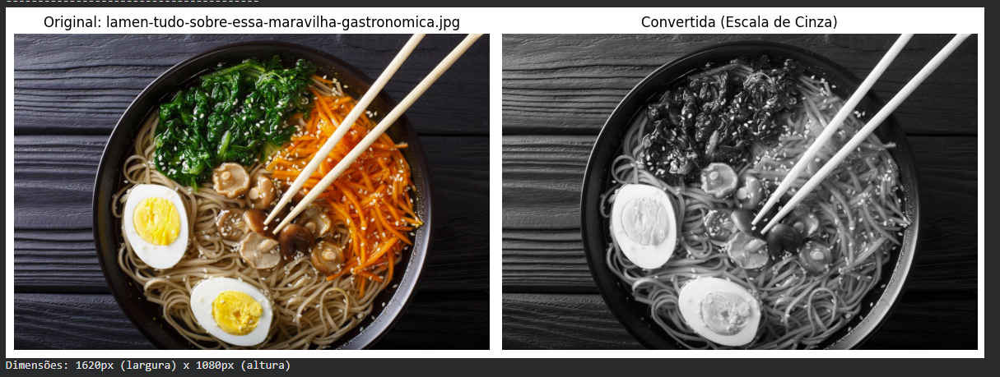
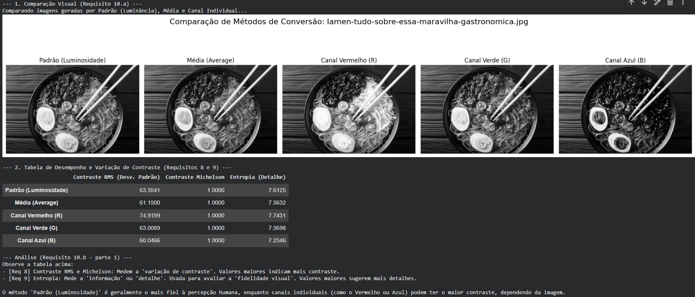
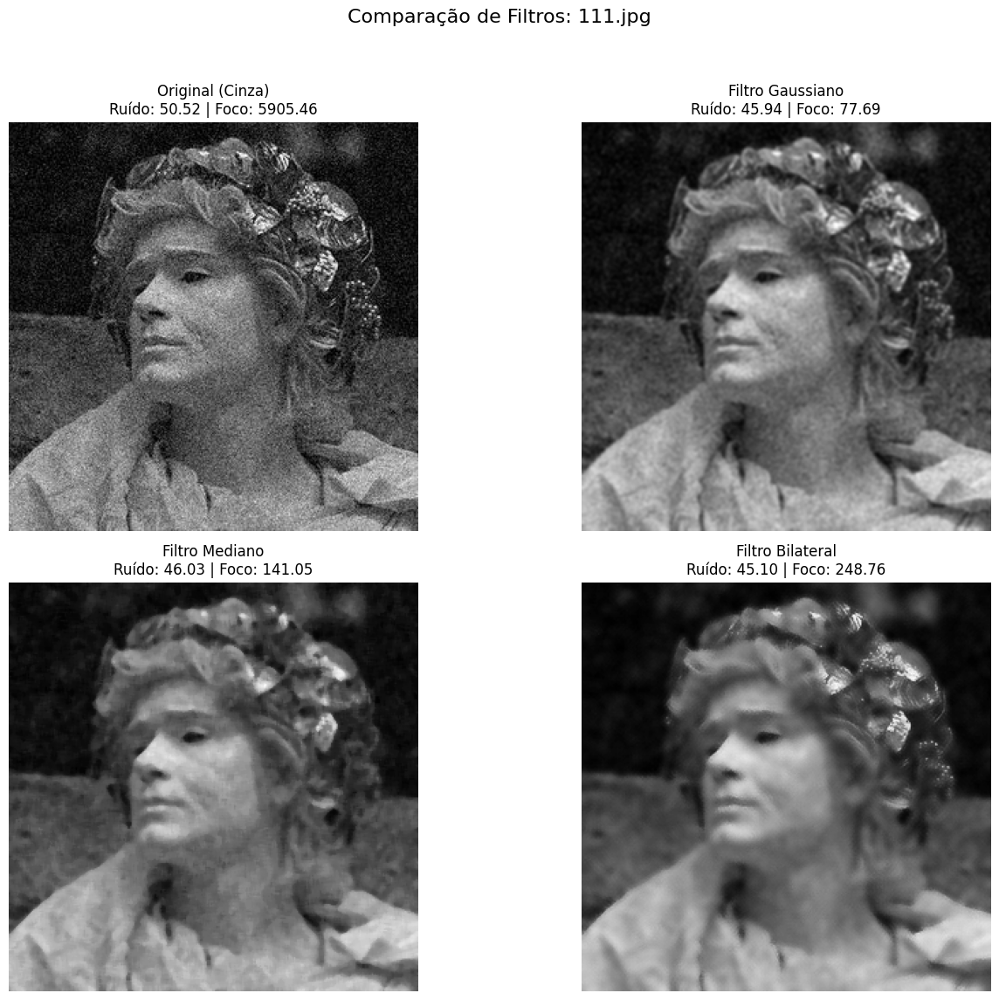
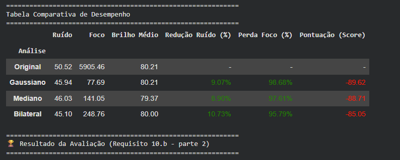
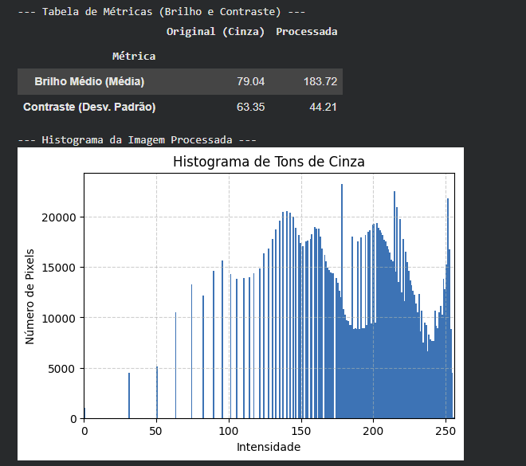
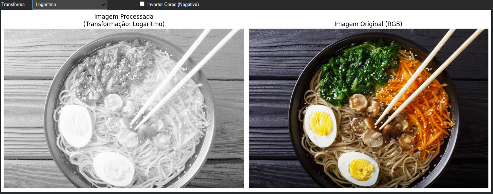

# Conversor de Imagens para Escala de Cinza
Projeto acadêmico desenvolvido para a disciplina de Processamento de Imagens e Computação Gráfica do curso de Ciência da Computação da Universidade Tiradentes (UNIT).

A aplicação é apresentada como um notebook interativo (Google Colab) que permite ao usuário carregar imagens coloridas, aplicar diferentes algoritmos de conversão para escala de cinza e analisar os resultados.

---

## 1. Objetivo do Módulo Desenvolvido
O objetivo principal deste projeto é uma aplicação de software capaz de converter imagens coloridas (RGB) para escala de cinza (preto e branco) com alta qualidade e eficiência. O foco é manter a fidelidade visual da imagem original, preservando detalhes importantes como texturas, contraste e iluminação, especialmente em retratos e fotos de natureza.

A aplicação permite ao usuário:
* Testar e comparar múltiplos algoritmos de conversão (Logaritmo, Quadrado, Exponencial, etc.).
* Analisar a imagem através de histogramas de tons de cinza.
* Visualizar canais de cor individuais.
* Aplicar efeitos (como negativo).
* Processar imagens em lote.

O público-alvo inclui profissionais da saúde, estudantes, acadêmicos e designers.

## 2. Bibliotecas Utilizadas
O projeto utiliza as seguintes bibliotecas Python para processamento de imagem e interface interativa:

* **OpenCV**
* **Matplotlib**
* **NumPy**
* **Pillow (PIL)**
* **IPython Widgets** (Para a interface interativa no Colab/Jupyter)
* **Scikit-image**

## 3. Instruções de Execução
Este projeto foi desenvolvido como um notebook interativo, otimizado para o ambiente Google Colab.

1.  Abra o arquivo `.ipynb` no Google Colab ou em um ambiente Jupyter local.
2.  Execute as células de instalação de dependências e importação das bibliotecas.
3.  Execute a célula principal que renderiza a interface do usuário (criada com `IPython Widgets`).
4.  Utilize a interface que aparecerá na saída da célula para:
    a. Fazer o **Upload** de uma ou mais imagens (formatos JPG, PNG).
    b. Visualizar a imagem original e a convertida **lado a lado**.
    c. **Selecionar o algoritmo** de conversão desejado no menu. O resultado será atualizado em tempo real.
    d. Utilizar as **funções adicionais**, como "Exibir Histograma" ou "Inverter (Negativo)".
    e. Fazer o **Download** da imagem processada.

## 4. Responsabilidades de Cada Integrante

A equipe foi composta por cinco integrantes, com as seguintes responsabilidades:

* **João Vinícius Vieira Menezes Góis** (Desenvolvedor de Backend):
    * Pesquisa, implementação e otimização dos algoritmos de conversão para escala de cinza.
    * Implementação das lógicas de processamento, como geração de histograma e efeito negativo.

* **João Pedro Diniz Guerra Rosa Cruz** (Desenvolvedor de Frontend/Interface):
    * Desenvolvimento da interface do usuário no ambiente Colab.
    * Implementação dos componentes de upload, exibição lado a lado, widgets interativos e botões de download.

* **Átila Gomes Viana** (Desenvolvedor de Funcionalidades Adicionais):
    * Implementação do processamento em lote (RF08).
    * Desenvolvimento da lógica para a visualização dos canais de cor individuais (RF09).

* **Matheus de Sena Tabosa Ferreira** (Analista de Qualidade e Testes):
    * Validação de todos os requisitos funcionais (RF) e não funcionais (RNF).
    * Execução de testes de desempenho, usabilidade e compatibilidade entre navegadores.

* **Roosevelt Andrade Alves** (Líder de Projeto e Documentador):
    * Supervisão do cronograma e garantia da coesão do projeto.
    * Liderança na elaboração da documentação técnica e final.

## 5. Exemplos de Saída
Abaixo estão alguns exemplos das análises e saídas geradas pela aplicação.

*(**Nota:** Para que estas imagens apareçam, faça o upload delas para o seu repositório (ex: uma pasta `assets/`) e atualize os caminhos abaixo.)*

---

#### Comparação Lado a Lado (RF04)
O sistema exibe a imagem original colorida à esquerda e a imagem processada em escala de cinza à direita, permitindo uma avaliação imediata da fidelidade e do contraste.

#### Comparação de Métodos de Conversão (Requisito 10.a)
A ferramenta permite comparar visualmente diferentes algoritmos de conversão (Padrão/Luminosidade, Média, Canal Vermelho, Verde e Azul) e apresenta uma tabela de métricas de contraste (RMS, Michelson) e entropia para uma análise quantitativa.

#### Análise de Filtros e Redução de Ruído (Requisito 10.b)
O usuário pode aplicar e comparar filtros de redução de ruído (Gaussiano, Mediano, Bilateral) para avaliar seu impacto visual na imagem.

A análise é complementada por uma tabela de desempenho que quantifica a **Redução de Ruído (%)**, a **Perda de Foco (%)** e o **Brilho Médio**, resultando em uma "Pontuação (Score)" para cada filtro.

#### Análise de Histograma e Métricas (RF11)
A aplicação gera o histograma de tons de cinza da imagem processada e exibe métricas-chave de **Brilho Médio (Média)** e **Contraste (Desv. Padrão)**, comparando a imagem original com a processada.

#### Transformações Adicionais (RF10)
Funções extras, como transformações (ex: Logaritmo, para realce de detalhes) e o efeito negativo (inversão de cores), também estão disponíveis diretamente na interface.

---

Video demo do projeto funcionando: https://drive.google.com/file/d/1Ib8aizQvvvLqgKVFDmydRiZeQ52udqp5/view?usp=sharing

---

### Equipe
* Átila Gomes Viana
* João Pedro Diniz Guerra Rosa Cruz
* João Vinícius Vieira Menezes Góis
* Matheus de Sena Tabosa Ferreira
* Roosevelt Andrade Alves

**Orientadora:** Prof. Layse Santos Souza

*Universidade Tiradentes (UNIT) - Aracaju/SE, 2025*
